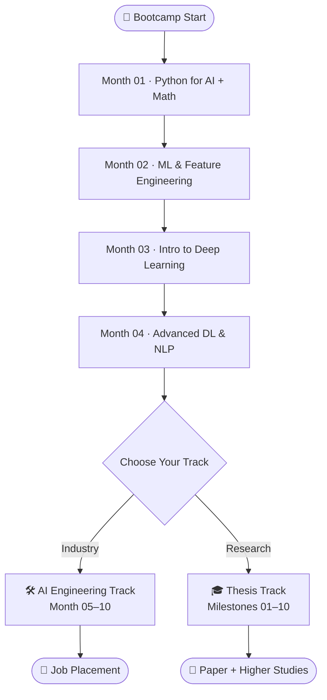
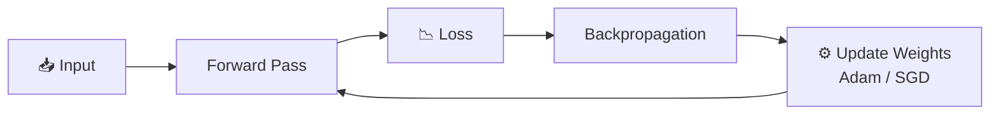
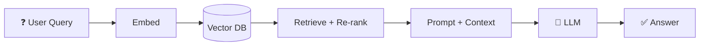

<!-- ===================== HEADER ===================== -->

 

---

## 👋 About This Repo

Hi, I'm **Joy** 👨‍💻 — a CSE student and full-stack developer (MERN, TypeScript, Next.js) who is now diving deep into **AI & Machine Learning Engineering**.

This repository is my **learning log, roadmap and portfolio** for the **Phitron AI Engineering Bootcamp (Batch 03)**. Everything I learn, build and break is documented here.

> 🎯 **Goal:** Become a job-ready AI Engineer who can design, build, evaluate and deploy production AI systems — and bring that power into the full-stack apps I already build.

---

## 🗺️ The Roadmap

---

## 📊 My Progress Tracker

> ✅ Tick the boxes as I go (edit this file → change `[ ]` to `[x]`).

| Phase | Focus | Status |
|:--|:--|:--:|
| 🟦 Month 01 | Python for AI Engineering + Math | 🔄 In Progress |
| 🟦 Month 02 | Machine Learning & Feature Engineering | ⏳ Upcoming |
| 🟦 Month 03 | Introduction to Deep Learning | ⏳ Upcoming |
| 🟦 Month 04 | Advanced Deep Learning & NLP | ⏳ Upcoming |
| 🟩 Month 05 | Backend with FastAPI | ⏳ Upcoming |
| 🟩 Month 06 | LLM Foundations & Prompt Engineering | ⏳ Upcoming |
| 🟩 Month 07 | LangChain & Vector Databases | ⏳ Upcoming |
| 🟩 Month 08 | Advanced RAG & Agentic AI (LangGraph) | ⏳ Upcoming |
| 🟩 Month 09 | MCP Orchestration & LLMOps | ⏳ Upcoming |
| 🟩 Month 10 | Production Capstone Project | ⏳ Upcoming |

---

## 📚 What I'm Learning

<b>🐍 Month 01 — Python for AI Engineering</b>

 

- [ ] **Core Python:** variables, data types, type casting, string methods, f-strings, docstrings
- [ ] **Collections:** lists, tuples, dictionaries, sets
- [ ] **Reusable code & control:** conditionals, loops, recursion, functions, lambda, `enumerate`
- [ ] **Production Python:** exception handling, custom exceptions, scope, file I/O
- [ ] **OOP:** classes, objects, constructors, dunder methods, encapsulation, inheritance
- [ ] **Libraries:** Streamlit, NumPy, Pandas, Matplotlib, Seaborn, Plotly

**➕ Mathematics for AI/ML**
- [ ] Linear algebra — vectors, matrices, eigenvalues/eigenvectors
- [ ] Probability — distributions, conditional probability, Bayes' theorem
- [ ] Statistics — mean/variance, sampling, hypothesis testing, confidence intervals
- [ ] Calculus — derivatives, partial derivatives, chain rule, gradients
- [ ] Optimization — gradient descent, learning rate, convex vs non-convex

<b>📈 Month 02 — Machine Learning & Feature Engineering</b>

 

- [ ] **EDA:** univariate & multivariate analysis, data profiling
- [ ] **Feature engineering:** train-test split, imputation, outliers, encoding, scaling
- [ ] **Regression:** linear regression, cost functions, gradient descent, MSE / MAE / RMSE / R²
- [ ] **Classification:** logistic regression, KNN, decision trees, random forest, SVM
- [ ] **Evaluation:** accuracy, precision, recall, F1, confusion matrix, ROC-AUC

<b>🧠 Month 03 — Introduction to Deep Learning</b>

 

- [ ] Perceptron, MLP, ANN
- [ ] Forward / backward propagation, chain rule, vanishing & exploding gradients
- [ ] Activations (ReLU, Sigmoid, Tanh, Softmax), loss functions
- [ ] Optimizers (SGD, Adam, Momentum), weight initialization
- [ ] Dropout, Batch Normalization, **PyTorch fundamentals**

<b>👁️ Month 04 — Advanced Deep Learning & NLP</b>

 

- [ ] CNN architectures, feature extraction, PyTorch CNN implementation
- [ ] RNNs, sequence modeling, context preservation
- [ ] Text preprocessing, tokenization, text representations, Word2Vec

<b>🛠️ AI Engineering Track (Month 05–10)</b>

 

**⚡ Backend with FastAPI**
- [ ] REST, HTTP, request/response lifecycle
- [ ] Routing, Pydantic, async execution
- [ ] SQLAlchemy, model serialization (Joblib/Pickle), model serving
- [ ] Auth, testing, benchmarking, Docker

**🤖 LLM Foundations & Prompt Engineering**
- [ ] Transformers & attention intuition
- [ ] Hallucinations, bias, privacy, guardrails
- [ ] OpenAI SDK, Gemini API, Hugging Face, Ollama
- [ ] Temperature, max tokens, streaming, JSON mode, function calling
- [ ] Zero-shot, few-shot, Chain-of-Thought, role structuring

**🔗 LangChain & Vector Databases**
- [ ] Prompt templates, output parsers, LCEL, runnables
- [ ] Chat history & persistent memory
- [ ] Document loaders, chunking, embeddings
- [ ] ChromaDB, FAISS, Qdrant, Pinecone, LanceDB, MongoDB vector search

**🕸️ Advanced RAG & Agentic AI (LangGraph)**
- [ ] Hybrid search, multi-query, parent-doc retrieval, re-ranking, context compression
- [ ] LangGraph nodes, edges, state
- [ ] Sequential / conditional / parallel / iterative graphs
- [ ] Tool calling, human-in-the-loop, multi-agent, reflection loops

**🔌 MCP Orchestration & LLMOps**
- [ ] Model Context Protocol — clients, servers, resources, custom tools
- [ ] LangGraph + MCP integration
- [ ] LangSmith & LangFuse tracing
- [ ] RAGAS & DeepEval, token cost & latency caching
- [ ] AWS EC2 deployment, CI/CD

**🏁 Production Capstone**
- [ ] Design, build, evaluate and deploy a multi-agent production platform

**🎁 Bonus Modules**
- [ ] AI System Design & Product Thinking
- [ ] AI-Assisted Coding Workflows
- [ ] Enterprise Multi-Agent Architecture
- [ ] Advanced Vectorless RAG

<b>🎓 Thesis Track (alternative path)</b>

 

| # | Milestone | Outcome |
|:-:|:--|:--|
| 01 | Research Foundation | Scope, research questions, FINER feasibility |
| 02 | Literature Review | Comparative matrix, research gaps |
| 03 | Proposal | Formal proposal, LaTeX/Overleaf, citations |
| 04 | Data & Methodology | Datasets, preprocessing, methodology |
| 05 | Experimental Design | Baselines, metrics, seeds & reliability |
| 06 | Implementation | Codebase, experiment logs, mid-thesis report |
| 07 | Results & Analysis | Tables, charts, ablation studies |
| 08 | Thesis Writing | Chapters, quality audits, manuscript |
| 09 | Publication & Defense Prep | Target venues, defense slides |
| 10 | Mock Defense | Viva voce, final submission |

---

## 🎯 My Targets

| 🏁 Target | 📌 Details |
|:--|:--|
| **Short term (1–4 months)** | Master Python, math, classical ML, deep learning & NLP foundations |
| **Mid term (5–10 months)** | Build and deploy RAG apps, LangGraph agents & MCP-powered systems |
| **Career** | Land an AI Engineer / GenAI Engineer role by **2027** |
| **Portfolio** | 1 real-domain project + 1 enterprise-grade capstone, live on GitHub |
| **Full-stack + AI** | Add AI features (RAG, agents, recommendations) to my MERN projects |
| **Habit** | Code daily, commit daily, write weekly notes |

### ✅ Personal Checklist
- [ ] Finish all foundation projects
- [ ] Publish at least 1 notebook / blog per month
- [ ] Contribute to an open-source AI repo
- [ ] Deploy a capstone on AWS with monitoring & evaluation
- [ ] Polish resume, GitHub & LinkedIn for AI roles
- [ ] Complete mock interviews

---

## 🧪 Projects

### 🟦 Foundation Projects
| Project | Description | Status |
|:--|:--|:--:|
| 🎙️ Personal AI Voice Assistant | Voice interaction + task execution | ⏳ |
| 🎵 Automated YouTube Mixtape Creator | Multi-threaded download & audio pipeline | ⏳ |
| 📉 Telecom Churn Predictor | Supervised classification pipelines | ⏳ |
| 🛍️ Recommendation System | Collaborative + content-based filtering | ⏳ |
| 🐞 Application Defect Classifier | PyTorch CNN transfer learning | ⏳ |

### 🟩 AI Engineering Projects
| Project | Description | Status |
|:--|:--|:--:|
| ⚙️ Enterprise FastAPI ML Microservice | Dockerized model serving + DB logging | ⏳ |
| 📖 Context-Aware Knowledge Assistant (RAG) | Hybrid vector search + context compression | ⏳ |
| 🧑‍💼 Autonomous Employee Onboarding Agent | LangGraph multi-agent + custom MCP servers | ⏳ |
| 🏢 Enterprise Production Capstone | AWS deploy, telemetry, RAGAS, cost/latency tracking | ⏳ |

---

## 🧰 Tech Stack

  

---

## 🧠 How a Neural Network Learns (Quick Visual)

---

## 📅 Weekly Learning Log

<b>Click to expand / add entries</b>

 

| Week | What I Learned | Built / Practiced | Notes |
|:-:|:--|:--|:--|
| 1 | _Python basics, data types_ | _Small scripts_ | _…_ |
| 2 | _…_ | _…_ | _…_ |
| 3 | _…_ | _…_ | _…_ |
| 4 | _…_ | _…_ | _…_ |

---

## 📈 GitHub Stats

 

---

## 🔖 Resources I'm Using

- 📘 [Phitron AI/ML Course](https://www.phitron.io/ai-ml-course)
- 🧠 [PyTorch Docs](https://pytorch.org/docs/stable/index.html)
- ⚡ [FastAPI Docs](https://fastapi.tiangolo.com/)
- 🔗 [LangChain Docs](https://python.langchain.com/)
- 🕸️ [LangGraph Docs](https://langchain-ai.github.io/langgraph/)
- 🔌 [Model Context Protocol](https://modelcontextprotocol.io/)
- 🤗 [Hugging Face](https://huggingface.co/)

---

## 📬 Connect With Me

 

> _"The best way to predict the future is to train it."_ 🤖

